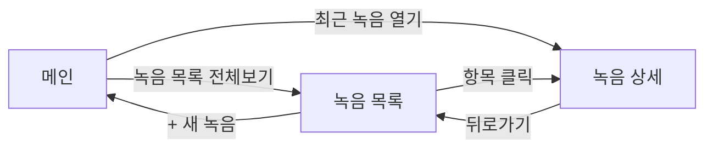

# MemoO PRD

2026-09-18 · @Someone

## 1. 개요 및 목적

MemoO는 Windows PC에서 완전히 로컬로 동작하는 오프라인 회의녹음 + 텍스트 변환(STT) 프로그램이다. 인터넷 연결이나 클라우드 서버 없이, 개인 PC 안에서 마이크 녹음부터 텍스트 변환, 회의록 조회까지 끝나는 것을 목표로 한다.

- 대면 회의 내용을 녹음하고 텍스트로 남겨 회의록 작성 부담을 줄인다
- 음성 데이터가 외부로 전송되지 않아 개인정보/보안 우려 없이 사용 가능
- 무료 배포를 통해 개인 브랜드(minulog.com) 인지도를 높이고, 다운로드 페이지 광고로 수익을 창출한다

## 2. 대상 사용자 및 사용 환경

| 항목 | 내용 |
| --- | --- |
| 대상 사용자 | 오프라인 대면 회의를 자주 하는 개인 (직장인, 프리랜서 등) |
| OS | Windows 10/11 (Mac/Linux 미지원) |
| 네트워크 | 인터넷 연결 없이 완전 오프라인 동작 |
| 회의 형태 | 마이크로 녹음하는 오프라인 대면 회의 (화상회의 캡처는 범위 밖) |
| 언어 | 한국어 회의 우선 지원 |

## 3. 핵심 기능 요구사항

1. **녹음**
   - 마이크 입력으로 녹음 시작/정지
   - 녹음 파일을 wav로 로컬 저장
2. **STT (텍스트 변환)**
   - faster-whisper 로컬 모델로 녹음 파일을 텍스트로 변환
   - 한국어 기본 지원, 모델 크기(small/medium) 선택 가능
3. **회의록 관리**
   - 회의 목록 조회 (날짜, 제목별)
   - 회의별 녹음 재생 + 변환 텍스트 확인
   - 텍스트 검색
4. **설치 및 실행 경험**
   - 설치 파일 실행 시 **바탕화면 아이콘 자동 생성**
   - 더블클릭으로 즉시 실행 가능

## 4. 비기능 요구사항

- **오프라인 동작**: STT 포함 전 기능이 인터넷 없이 동작해야 함
- **로컬 처리 전용**: 녹음/텍스트 데이터가 외부 서버로 전송되지 않음
- **설치 경험**: PyInstaller로 만든 exe만으로는 바탕화면 아이콘이 자동 생성되지 않으므로, Inno Setup 또는 NSIS 기반 설치 프로그램을 별도로 만들어 설치 시 바탕화면 바로가기를 생성해야 함
- **성능**: 일반 사무용 PC(CPU only) 기준 30분 녹음 처리 시간 목표치 정의 필요 (모델 크기별 벤치마크 후 확정)
- **안정성**: 녹음 중 프로그램 강제 종료 시에도 지금까지 녹음된 파일은 보존

## 5. 기술 스택 및 아키텍처

| 영역 | 선택 |
| --- | --- |
| 언어 | Python |
| GUI | PySide6 |
| 녹음 | sounddevice |
| STT | faster-whisper (로컬 모델) |
| DB | SQLite |
| 패키징 | PyInstaller (exe 빌드) |
| 설치 프로그램 | Inno Setup 또는 NSIS (바탕화면 아이콘 생성용) |

웹 서버(FastAPI), 클라우드(Oracle Cloud/Vercel), MySQL, Tauri/Electron은 사용하지 않는다.

## 6. 범위 제외 사항 (v1 기준)

- Mac/Linux 지원
- 온라인 회의(화상회의 화면·음성 캡처)
- 화자 구분(diarization)
- LLM 기반 회의록 자동 요약
- Obsidian 등 외부 도구 연동/export
- 웹앱, 클라우드 동기화

## 7. 배포 및 수익화 계획

- 앱 자체는 완전 무료 배포
- exe/설치 파일은 GitHub Releases(memo-o 저장소)에 업로드
- minulog.com에 별도 다운로드 페이지 제작 (기존 Vue3 + Vercel 인프라 재사용)
- 다운로드 페이지에 Google AdSense 배치하여 수익화, 앱 내부에는 광고 없음

## 8. 법적/개인정보 고려사항

- 통신비밀보호법상 본인이 참여한 회의를 녹음하는 것은 상대방 동의 없이도 적법하나, 본인이 참여하지 않은 대화를 몰래 녹음하는 것은 불법(1년 이상 10년 이하 징역)이므로 사용자 책임임을 앱/다운로드 페이지에 고지
- 음성 데이터가 로컬에서만 처리되어 외부로 전송되지 않는다는 점을 명시 (개인정보 관련 리스크 완화 요인)
- 다운로드 페이지에 개인정보처리방침 게시 (Google AdSense 심사 요건)
- faster-whisper 등 오픈소스 라이브러리 라이선스(MIT) 고지

## 9. 개발 로드맵

1. 파이썬 환경 준비 (venv, 패키지 설치)
2. 마이크 녹음 기능 구현 (sounddevice → wav)
3. faster-whisper STT 연동
4. PySide6 GUI + SQLite 회의록 관리 기능
5. PyInstaller exe 패키징
6. Inno Setup/NSIS 설치 프로그램 제작 (바탕화면 아이콘 포함)
7. minulog.com 다운로드 페이지 제작 및 배포

## 10. UI/UX

인터랙티브 목업: [MemoO UI 목업](https://claude.ai/artifact/KZc2BkySoNRNpSuXagZH4Z) (클릭 가능, 3화면 연결) 상세 스펙은 프로젝트 파일 `UI_SPEC.md`에 색상/치수/컴포넌트 단위로 정리되어 있음 (Claude Code 개발 시 참조).

- **창 크기**: 440 x 640px (작고 심플한 유틸리티 앱)
- **녹음 버튼**: 지름 96px 원형, 항상 빨간색(#D13438) — 대기 시 흰 원 아이콘, 녹음 중엔 흰 사각형 아이콘으로 전환, 클릭 시 토글
- **문구**: "회의"에 국한하지 않고 "아이디어 메모", "강의 노트" 등 범용 표현 사용
- **목록 화면**: 좁은 폭에 맞춰 테이블이 아닌 카드형 스택 리스트

### 화면 1. 메인(녹음)

```
+--------------------------+
|  MemoO              _ □ x |
+--------------------------+
|                            |
|         ( ● )  <- 빨간 원형 |
|         녹음 시작          |
|                            |
|  상태: 대기 중  시간: 00:00:00 |
|  마이크: [ 기본 마이크 ▼ ]   |
|                            |
|  최근 녹음 ---------------- |
|  · 09-18  아이디어 메모 [열기]|
|  · 09-17  강의 노트    [열기]|
|  · 09-15  고객 상담    [열기]|
|                            |
|  [ 녹음 목록 전체보기 ]      |
+--------------------------+
```

### 화면 2. 녹음 목록 (카드형)

```
+--------------------------+
|  MemoO - 녹음 목록   _ □ x |
+--------------------------+
| [검색_______]  [+ 새 녹음] |
+--------------------------+
| 아이디어 메모        완료  |
| 09-18 · 32:10              |
|----------------------------|
| 강의 노트            완료  |
| 09-17 · 18:44              |
|----------------------------|
| 고객 상담         변환중  |
| 09-15 · 12:05              |
+--------------------------+
|   < 이전   1/3   다음 >    |
+--------------------------+
```

### 화면 3. 녹음 상세

```
+--------------------------+
| ← 아이디어 메모 ·09-18 _□x |
+--------------------------+
| ◀◀  ▶ ▶▶  [====○---] 14:22/32:10 |
+--------------------------+
| [ 검색_________________ ] |
|----------------------------|
| 00:00 오늘 안건은 두 가지...|
| 00:45 API 응답 지연 건은...|
| 01:20 다음 주까지 픽스...  |
|                            |
| [ 내보내기 ]   [ 삭제 ]    |
+--------------------------+
```

### 화면 흐름


